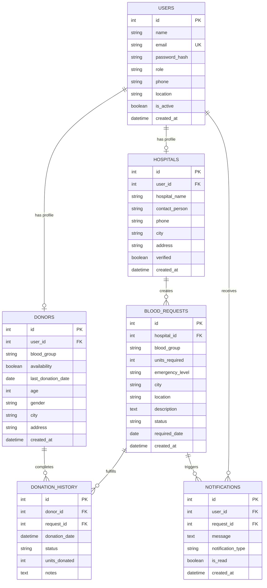

# 🩸 Blood Donor Finder (BloodDonorFinder3D)

> **Final-Year B.Tech IT Capstone Portfolio Project**  
> An intelligent, full-stack web application connecting blood donors, medical facilities, and administrators in real-time for routine and critical emergency blood requirements.

---

## 📌 Project Overview

Blood transfusions are critical to modern medicine, yet locating compatible, available donors during emergencies remains challenging. **Blood Donor Finder** bridges this gap by providing an end-to-end digital coordination platform featuring:
- **Intelligent Blood Compatibility Engine**: Accurately computes Red Blood Cell (ABO/Rh) compatibility matching.
- **Three-Tier Role Architecture**: Customized dashboards and permissions for **Donors**, **Hospitals**, and **System Administrators**.
- **Emergency Priority Alerts**: High-urgency notifications automatically dispatched to nearby compatible donors.
- **3D Interactive Experience**: Immersive Three.js 3D visual elements designed for showcase in campus placements and technical interviews.

---

## 🛠️ Technology Stack

| Layer | Technology |
| :--- | :--- |
| **Backend Framework** | Python 3.14+, Flask 3.1 |
| **ORM & Database** | Flask-SQLAlchemy 3.1+, SQLite (Dev) / MySQL-ready |
| **Security** | Werkzeug PBKDF2:SHA256 password hashing, HTTP-only session cookies |
| **Frontend** | HTML5, Modern CSS3 (Glassmorphism & Flex/Grid), Vanilla JavaScript (ES6+) |
| **3D Graphics** | Three.js (WebGL with automatic fallback) |
| **Testing** | Python `unittest` test suite |

---

## 📂 Project Architecture

```
BloodDonorFinder3D/
│
├── app.py                     # Flask application factory & CLI commands
├── config.py                  # Environment-specific configuration classes
├── models.py                  # SQLAlchemy ORM models (User, Donor, Hospital, etc.)
├── requirements.txt           # Python dependencies
├── README.md                  # Complete technical documentation
├── .gitignore                 # Git ignore rules
├── .env.example               # Environment variables template
│
├── utils/
│   ├── __init__.py
│   ├── compatibility.py       # Red blood cell compatibility matrix & disclaimer
│   └── decorators.py          # Session auth & role-based access decorators
│
├── routes/
│   ├── __init__.py            # Blueprint registry
│   ├── main.py                # Public landing, about, directory, emergency
│   ├── auth.py                # Registration, login, logout, password hashing
│   ├── donor.py               # Donor dashboard, availability, requests, history
│   ├── hospital.py            # Hospital dashboard, blood requests, donor search
│   ├── admin.py               # Admin oversight, hospital verification, analytics
│   └── api.py                 # RESTful JSON endpoints (search, compatibility, stats)
│
├── templates/                 # Jinja2 templates (Semantic HTML5)
│   ├── base.html
│   ├── index.html
│   ├── about.html
│   ├── login.html
│   ├── register.html
│   ├── find_donor.html
│   ├── emergency_request.html
│   ├── donor/
│   ├── hospital/
│   ├── admin/
│   └── errors/
│
├── static/
│   ├── css/                   # Modular responsive stylesheets
│   ├── js/                    # Main logic & Three.js 3D interactive hero
│   ├── images/                # UI icons & branding
│   └── models/                # 3D assets & materials
│
├── database/
│   ├── seed.py                # Realistic development database generator
│   └── blood_donor.db         # SQLite database file
│
└── tests/
    ├── __init__.py
    ├── test_compatibility.py   # ABO/Rh compatibility logic unit tests
    └── test_models.py          # ORM models, relationships & password tests
```

---

## 🗄️ Database Design

The database contains 6 relational tables designed with strict constraints and cascading rules:



---

## 🔬 Blood Compatibility Logic

Standard Red Blood Cell (ABO and Rh factor) compatibility rules:

| Recipient Blood Group | Compatible Donor Blood Groups | Notes |
| :--- | :--- | :--- |
| **O-** | `O-` | Universal donor; recipient can only receive O- |
| **O+** | `O-`, `O+` | Rh positive can receive from Rh negative or positive |
| **A-** | `O-`, `A-` | Can receive O- and A- |
| **A+** | `O-`, `O+`, `A-`, `A+` | Common blood group |
| **B-** | `O-`, `B-` | Can receive O- and B- |
| **B+** | `O-`, `O+`, `B-`, `B+` | Compatible with O and B |
| **AB-** | `O-`, `A-`, `B-`, `AB-` | Can receive from all Rh- types |
| **AB+** | `O-`, `O+`, `A-`, `A+`, `B-`, `B+`, `AB-`, `AB+` | **Universal Recipient** (all 8 groups) |

> ⚠️ **Medical Disclaimer**: Blood compatibility calculations represent algorithmic guidelines for initial screening and coordination. Actual clinical transfusions require full laboratory cross-matching verified by qualified healthcare professionals.

---

## 🚀 Quick Start & Installation

### 1. Prerequisites
- Python 3.10+ installed
- Git

### 2. Navigate to Project Directory
```bash
cd BloodDonorFinder3D
```

### 3. Install Dependencies
```bash
pip install -r requirements.txt
```

### 4. Initialize and Seed the Database
Populate realistic development records (admin, hospitals, all 8 blood groups, emergency requests):
```bash
python database/seed.py
```

### 5. Run the Application
```bash
python app.py
```
Visit `http://localhost:5000` in your web browser.

---

## 🧪 Running Unit Tests

Run the automated test suite covering models, relationships, password hashing, and blood compatibility:
```bash
python -m unittest discover -s tests -p "test_*.py" -v
```

---

## 🔑 Test Accounts (Development Data)

| Role | Email | Password | Details |
| :--- | :--- | :--- | :--- |
| **Admin** | `admin@blooddonor.org` | `Admin@123` | Full administrative control |
| **Hospital** | `metro@hospital.org` | `Hospital@123` | Metro Trauma & Health Center (New York) |
| **Hospital** | `stjude@hospital.org` | `Hospital@123` | St. Jude Central Hospital (Chicago) |
| **Hospital** | `hopevalley@hospital.org`| `Hospital@123` | Hope Valley Clinic (Pending verification) |
| **Donor (O-)** | `alex.hayes@example.com` | `Donor@123` | Universal Donor (Chicago) |
| **Donor (O+)** | `emily.watson@example.com` | `Donor@123` | Active Donor (New York) |
| **Donor (A+)** | `marcus.davis@example.com` | `Donor@123` | Active Donor (Los Angeles) |
| **Donor (AB+)**| `lucas.rossi@example.com` | `Donor@123` | Universal Recipient (Los Angeles) |

---

## 🌐 REST API Endpoints

- `GET /api/stats` - Live platform metrics (available donors, active requests).
- `GET /api/compatibility?donor=O-&recipient=A+` - Checks compatibility between two blood groups.
- `GET /api/compatibility?blood_group=AB+&mode=as_recipient` - Returns all compatible donor groups.
- `GET /api/donors/search?blood_group=O-&city=Chicago` - Search donors with filters.
- `GET /api/notifications` - Fetch user's unread notifications.
- `POST /api/notifications/<id>/mark-read` - Mark a notification as read.

---

## 💡 Interview Talking Points

1. **Why Flask with Blueprints?**
   - Blueprints decouple features into independent modules (`auth`, `donor`, `hospital`, `admin`, `api`), adhering to the Single Responsibility Principle and MVC separation.
2. **Password Security:**
   - Werkzeug's `pbkdf2:sha256` hashing with automatic salting ensures plain-text credentials are never stored.
3. **Database Relationships & Integrity:**
   - 1-to-1 relationship for User profiles (`uselist=False`, `cascade='all, delete-orphan'`), foreign key indexing on frequent filter columns (`blood_group`, `city`, `status`).
4. **Graceful 3D Degradation:**
   - The Three.js 3D blood-drop hero element checks for WebGL availability. If unsupported or disabled, an animated CSS/SVG fallback renders seamlessly.
